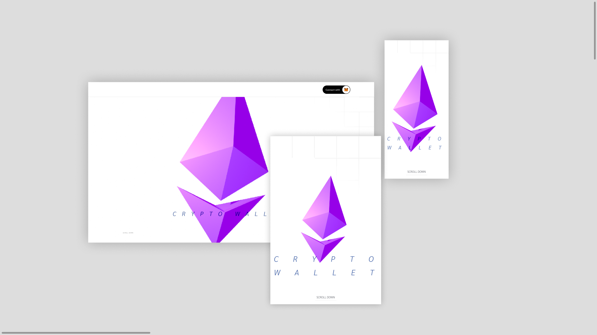

# Seja bem vindo ao Crypto Wallet! 🎊



<br/>

## Motivação 😎💪

Neste projeto e design, busquei criar algo mais criptográfico, imersivo e simples. Acredito que um site de blockchain deva ter um caráter mais metaverso e tridimensional, já que blockchain são blocos. Segue o design no [Figma](https://www.figma.com/file/BAYEWh3EI9wS343p5kVTDt/my-coin?type=design&node-id=0-1&mode=design&t=RsvVxwD5xlRRBDjj-0).

## Como clonar este repositório

1. Abra o terminal ou prompt de comando.

2. Navegue até o diretório onde deseja clonar o repositório.

3. Use o comando `git clone` seguido pelo URL do repositório. Por exemplo:


   ```sh
   git clone https://github.com/seu-usuario/seu-repositorio.git
   ```

## Instalacao e como Rodar ‍💻

Instale o Node Package Manager (NPM) em sua máquina. Após a instalação, execute os comandos abaixo no mesmo diretório do projeto:

```cmd
npm install
npm run dev
```

## Utilizar testes 🧪

Depois de você ter completado a fase de [Instalação](#instalacao-e-como-rodar-‍💻) basta você rodar os comandos a seguir no terminal, certificando-se de que está no repositório raiz:

```cmd
  npm run test
```

## Requisitos Funcionais

- [x] Exibir uma lista das 10 principais criptomoedas por capitalização de mercado;
- [x] Cada item deve incluir o nome da criptomoeda, o símbolo e o preço;
- [x] Ao clicar em uma moeda, o usuário deve ser redirecionado para uma página de detalhes, que inclui informações adicionais, como: variação de 24h, alta e baixa em 24h, volume de mercado;
- [x] Integração com a Wallet Metamask;
- [x] A Wallet Metamask exibe a conexão e o saldo atual de Ethereum do usuário;
- [x] Responsividade que garanta uma boa experiência;- [x] Exibir uma lista de 10 criptomoedas por capitalizacao de mercado;

## Miscellaneous

- Gráfico do preço da moeda, se possível.